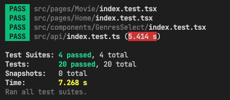

# Challenge PorterGroup

# How reproduce ?
1. You need create a .env file in root project and put your key generated in IMDB master account
`REACT_APP_API_KEY=YOUR_API_KEY_IMDB`

2. Install packages with npm or yarn

3. Run 
`yarn start`

4. Run tests 
`yarn test`
   
# Tests in final commit

